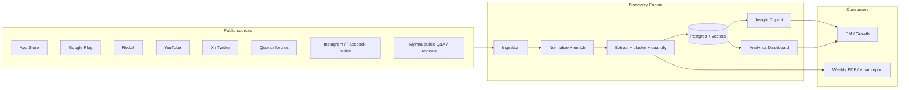
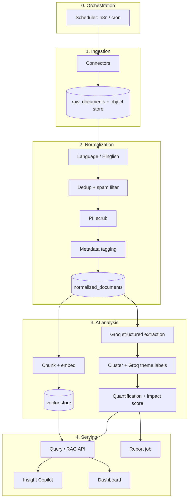
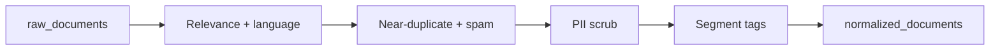
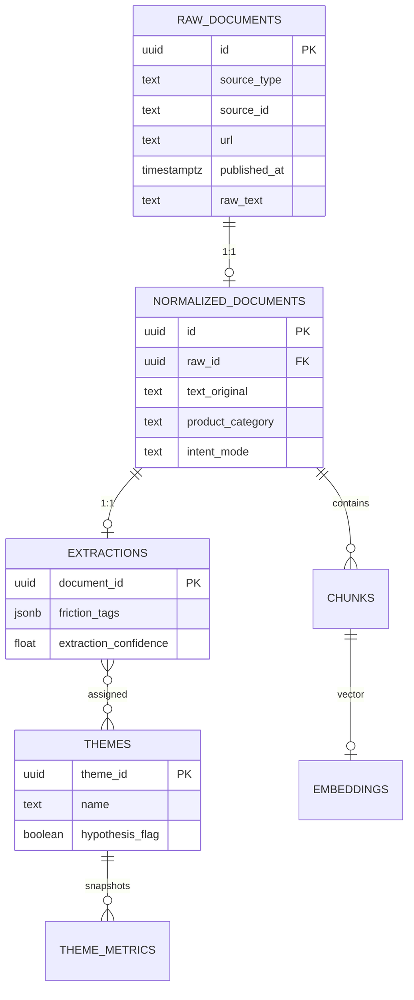
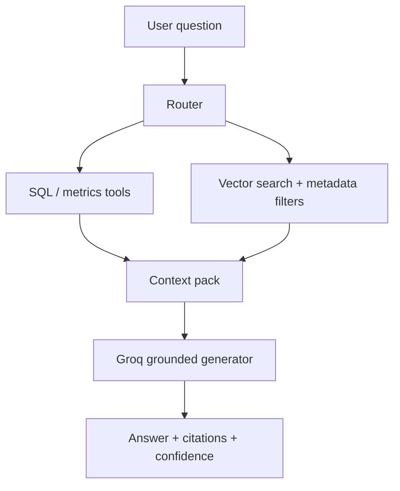
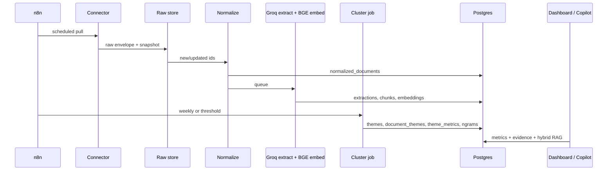

# Architecture

**Project:** AI-Powered Discovery Engine for Myntra Wishlist Behavior  
**Companion docs:** [problemStatement.md](./problemStatement.md), [ImplementationPlan.md](./ImplementationPlan.md)  
**Status:** Target architecture for the research prototype (not a production-scale scraping platform)

**Model stack (locked):** generation = **Groq only**. Vectors = local **BGE** (`BAAI/bge-m3`, 1024-d). Do not use OpenAI chat or OpenAI embedding models. This supersedes problem-statement mentions of Claude / GPT as the LLM.

---

## 1. Purpose of this document

This document specifies **how** the Discovery Engine is built: system boundaries, layers, data model, pipelines, retrieval, surfaces, and analytical contracts.

It implements the problem statement’s constraints:

- The **user problem is discovered**, not assumed.
- Outputs are **structured, quantified, and queryable**, not generic summaries.
- Every claim is backed by **verbatim-adjacent evidence**, **share of voice**, and **confidence / data density**.
- Only **public, non-PII** conversation data is ingested.
- Competitor brands are **not** a parallel corpus; they appear only as mentions inside Myntra-relevant conversations.
- Product solution design, recommendation models, and production scraper scale are **out of scope**.

---

## 2. System context

### 2.1 Who uses it

| Actor | Need |
| --- | --- |
| **PM / Growth** | Ask Q1–Q9 in natural language; get cited, quantified answers. |
| **Research / Insights** | Explore themes, segments, trends; drill to quotes; audit tags. |
| **Pipeline operator** | Schedule ingest, monitor failures, re-run enrichment / clustering. |

There is no consumer-facing Myntra shopper product in this system.

### 2.2 External systems



### 2.3 Explicit non-integrations

The engine does **not** connect to Myntra internal analytics (funnel, wishlist conversion, session replay). Those are downstream triangulation sources. Themes that would require them are labeled **hypothesis, needs product-analytics triangulation**.

---

## 3. Design principles

1. **Evidence first.** Aggregates always join back to source documents and quote spans. No interpolated counts when a source is missing or unreliable.
2. **Two stores, one truth.**  
   - **Relational (Postgres):** documents, tags, themes, metrics, scores.  
   - **Vector:** chunk embeddings for semantic retrieval.  
   Both surfaces read the same IDs; the chatbot must not invent numbers that the dashboard cannot reproduce.
3. **Hybrid answering.** Comparative / quantitative questions hit **SQL aggregates**. Open-ended “why” questions hit **retrieval + structured filters**, then **Groq** cites both quotes and counts.
4. **Thin evidence → refuse or caveat.** Below confidence thresholds the Copilot declines a firm answer rather than filling gaps.
5. **Bookmark vs stall is a first-class split.** `intent_mode` (near-term purchase vs passive bookmark / inspiration) is extracted and stored separately from `friction_tag`.
6. **Privacy at the analysis boundary.** Usernames and other PII are hashed or dropped **before** enrichment and embeddings. Raw blobs may keep a hashed author id for dedup only.
7. **Prototype-honest ingestion.** Prefer working connectors for 4–5 source types over brittle coverage of every social surface. Unimplemented sources are marked **unavailable** in metrics, not estimated.

---

## 4. Logical architecture



| Layer | Responsibility | Writes | Reads |
| --- | --- | --- | --- |
| Ingestion | Fetch public posts/reviews/comments; persist immutable raw records | `raw_documents`, object store | Source APIs |
| Normalization | Language, quality, PII, inferred segments | `normalized_documents` | Raw |
| AI analysis | Extract tags, embed, cluster themes, compute metrics | `extractions`, `chunks`, `themes`, `theme_metrics`, vectors | Normalized |
| Serving | Copilot, dashboard, reports | Chat sessions, report artifacts | All structured + vectors |

---

## 5. Technology choices (prototype)

Choices below are **defaults for a working prototype**. Swap vector DB without changing the logical contracts. The **product UI is Next.js** (Implementation Plan Phase 6); do not substitute Streamlit.

| Concern | Default | Rationale |
| --- | --- | --- |
| Orchestration | **n8n** (or cron + Python if n8n is overkill) | Visual retries, schedules, secrets; matches problem statement |
| Connectors | Python workers: **google-play-scraper**, App Store scraper, **PRAW**, **YouTube Data API**, Playwright/Apify for remaining public pages | One language for ingest + NLP |
| Object store | Local disk / S3-compatible bucket | Immutable raw JSON/HTML snapshots |
| System of record | **PostgreSQL** | Analytics SQL + optional **pgvector** |
| Vector search | **pgvector** (same DB) or Chroma if isolating vectors | Prototype simplicity; Pinecone only if embedding volume outgrows Postgres |
| Embeddings | **BGE** (`BAAI/bge-m3`) via `sentence-transformers` / FlagEmbedding, **local** | Replaces OpenAI `text-embedding-*`. Multilingual dense vectors for Hinglish. |
| Extraction / Copilot / reports LLM | **Groq Cloud** + JSON schema / tool calling | Replaces Claude / GPT-host. Groq’s HTTP API is OpenAI-*compatible*; the host is Groq, not OpenAI. |
| Clustering | BGE embeddings + **HDBSCAN** (k-means fallback for tiny corpora) | Variable theme count; noise cluster for anecdotes |
| Dashboard | **Next.js (App Router) + TypeScript** in `web/` | One product UI for Copilot + all Surface B views. Not Streamlit; not Metabase-as-the-app. |
| Copilot API | **FastAPI** Query API (`src/api`) | Query embedding with BGE; generation + tools on Groq. Frontend is a client of this API. |
| Reports | Groq narrative + matplotlib/plotly charts → PDF | Weekly job in n8n |

### 5.1 Model stack (locked)

All generation goes through **Groq**. All vectors are **BGE**, computed in-process. Do not call OpenAI (or any other host) for embeddings or chat.

| Role | Default | Notes |
| --- | --- | --- |
| Groq — extraction, Copilot | `openai/gpt-oss-120b` | **Groq-hosted** model id (not the OpenAI API). Stronger structured JSON and tool use. Override via `GROQ_MODEL`. |
| Groq — theme labels, weekly report | `openai/gpt-oss-20b` | **Groq-hosted** light model. Cheaper/faster; same grounding rules. Override via `GROQ_MODEL_LIGHT`. |
| Groq API | `https://api.groq.com/openai/v1` | OpenAI-*compatible* HTTP. Use `GROQ_API_KEY` only. Do **not** call `api.openai.com` for chat or embeddings. |
| Embedding | `BAAI/bge-m3` | Dense dim **1024**. Store as `vector(1024)` in pgvector. L2-normalize before insert (cosine). |
| Embedding runtime | Hugging Face weights, local CPU (GPU optional) | First run downloads the model (~2GB). Cache under `HF_HOME` / `./data/models`. |

**Why BGE-M3, not an English-only BGE:** a large share of Myntra reviews is Hinglish / Hindi. `bge-m3` is multilingual. `BAAI/bge-small-en-v1.5` (384-d) is an emergency fallback if memory is tight; expect weaker retrieval on non-English text and a full re-embed if you switch.

**BGE encode contract**

- **Documents:** embed PII-scrubbed `chunk.text` as-is (do not translate first).  
- **Queries (Copilot / search):** embed the user question with the **same** checkpoint. For `bge-*-en-v1.5` only, prefix queries with `Represent this sentence for searching: `. **M3 does not use that prefix** (FlagEmbedding / sentence-transformers defaults).  
- Persist `embedding_model = BAAI/bge-m3` (or the exact revision hash) on the collection. Changing checkpoint or dim requires a full re-embed.

**Groq generate contract**

- Structured extraction: JSON schema or `response_format: json_object` plus a Pydantic validator; retry on invalid JSON.  
- Copilot: Groq **tool calling** against the Query API; numbers in the answer must come from tool JSON.  
- Treat Groq 429 / TPM limits as first-class: exponential backoff, batch size caps, `extraction_status=failed` after N retries — never drop the document from the evidence table.

**Prototype source coverage (minimum 4–5 types):**

1. Google Play (Myntra app)  
2. Apple App Store (Myntra app)  
3. Reddit (Myntra-filtered search)  
4. YouTube comments (haul / size-guide / vs-competitor queries)  
5. One of: Quora, X public search, or Myntra public product Q&A/reviews  

Instagram / Facebook groups are **optional**; treat as unavailable until a public, ToS-compliant path exists.

---

## 6. Ingestion layer

### 6.1 Connector contract

Every connector emits the same **raw envelope**, regardless of source:

| Field | Type | Notes |
| --- | --- | --- |
| `source_type` | enum | `play_store`, `app_store`, `reddit`, `youtube`, `x`, `quora`, `forum`, `instagram`, `facebook`, `myntra_qa`, `myntra_review`, `other` |
| `source_id` | string | Native id (review id, comment id, post id) |
| `url` | string | Canonical public URL |
| `fetched_at` | timestamptz | Pull time |
| `published_at` | timestamptz \| null | Authoring time if the API provides it |
| `platform` | string | e.g. android, ios, reddit, youtube |
| `raw_text` | text | Body only |
| `raw_title` | text \| null | Review title / post title |
| `star_rating` | int \| null | App store / product reviews |
| `parent_context` | jsonb | Subreddit, video title, product name guess, thread title |
| `author_hash` | string \| null | HMAC of username; never store plaintext username in analysis tables |
| `payload_uri` | string | Pointer to full JSON snapshot in object store |
| `myntra_relevance` | enum | `explicit` \| `inferred` \| `reject` — reject dropped before normalize |

**Relevance gate:** Keep a document only if it is about **Myntra shopping / wishlist / cart / sizing / returns / fashion purchase on Myntra**. Competitor names (AJIO, Nykaa Fashion, Flipkart Fashion, Meesho) are allowed **inside** those documents, not as seed crawls of competitor app pages.

### 6.2 Incremental pulls

- **App stores:** pull newest reviews since `max(published_at)` per store.  
- **Reddit / YouTube / X:** search queries + `since` watermark.  
- **Idempotency:** unique `(source_type, source_id)`. Re-fetches update `fetched_at` and payload; they do not duplicate rows.

### 6.3 Query seeds (examples)

Connectors should be driven by a versioned `ingest_queries` table (editable without code):

- `"Myntra wishlist"` / `"Myntra cart"` / `"Myntra sizing"` / `"Myntra returns"`  
- `"Myntra vs AJIO"` (only to capture comparison talk in Myntra-relevant threads)  
- YouTube: haul, try-on, size guide, unboxing, vs-competitor titles mentioning Myntra  
- Subreddits listed in the problem statement, plus site-wide search for `Myntra`

### 6.4 Legal / ToS posture

- Public APIs and official scraper libraries first.  
- No authenticated / private group content.  
- Rate-limit and backoff per source.  
- Store robots/ToS notes per connector; disable a source rather than scrape around blocks.

---

## 7. Normalization and enrichment

Pipeline is **deterministic first, Groq second**. Language and PII should not depend on a chatty model when a classifier or regex suffices.



### 7.1 Language

- Detect language (`en`, `hi`, `hinglish`, `other`).  
- **Do not** blindly translate before extraction: Hinglish often carries the signal (fit slang, price talk).  
- Store `text_original` and optional `text_en` (translation) for retrieval. The Groq extraction call sees original + a short English gloss when confidence is low.

### 7.2 Dedup and quality

- Exact hash of normalized whitespace.  
- Near-dup: MinHash / embedding cosine above threshold on short texts.  
- Drop: empty, emoji-only, store-boilerplate, obvious bot templates, off-topic after relevance gate.  
- Keep a `quality_score` (0–1) for weighting in quantification (optional; never silently drop from the evidence table).

### 7.3 PII scrub

Before `normalized_documents` and before embeddings:

- Strip emails, phones, order IDs, addresses.  
- Drop or hash display names.  
- Do not embed raw usernames.

### 7.4 Inferred metadata

| Tag | How | Confidence |
| --- | --- | --- |
| `product_category` | Keyword + Groq: ethnic, western, dresses, footwear, accessories, beauty-adjacent, unknown | required |
| `gender_segment` | Infer from text / product cues; default `unknown` | never invent |
| `price_tier` | Budget / mid / premium from price mentions or brand cues | unknown if absent |
| `platform_used` | App vs web if stated | unknown if absent |
| `occasion` | Wedding, office, everyday, party, unknown | |
| `star_rating` | From source | |
| `review_date` | `published_at` | |

Unknown is a **valid segment**. Dashboards must show “unknown” rather than forcing assignment.

---

## 8. AI analysis layer

Three jobs, separately schedulable: **extract**, **embed**, **cluster + quantify**. Clustering should not re-run on every new document; incrementally assign new docs to existing themes, and **recluster** on a weekly cadence or after N new docs.

### 8.1 Chunking and embeddings

- Unit of retrieval: **chunk** ≈ 200–500 tokens, overlapping 50 tokens, preferably one comment/review = one chunk when short.  
- Encode with **BGE-M3** locally (`sentence-transformers` or FlagEmbedding); write L2-normalized `vector(1024)` to pgvector.  
- Metadata on each vector: `document_id`, `source_type`, `published_at`, `product_category`, `intent_tag`, `friction_tag`, `intent_mode`, `sentiment`.  
- Embedding model id + revision stored on the collection so re-embeds are explicit. Do not mix BGE checkpoints in one table.

### 8.2 Structured extraction (per document)

**Groq** call with a **JSON schema** (tool / structured output or `json_object` mode). Nulls are allowed; the model must not guess. Validate with Pydantic; invalid payloads retry, then `extraction_status=failed`.

```json
{
  "intent_tag": "price_watch | save_for_later | bookmark | mood_board | indecision_parking | gift | restock_wait | unknown | not_applicable",
  "intent_mode": "near_term_purchase | passive_bookmark | mixed | unknown",
  "friction_tag": [
    "fit_uncertainty",
    "quality_doubt",
    "return_risk",
    "authenticity",
    "styling_doubt",
    "price_sensitivity",
    "review_credibility",
    "social_validation",
    "policy_trust",
    "comparison_paralysis",
    "delivery_or_availability",
    "other"
  ],
  "residual_uncertainties": ["fit", "quality", "returns", "authenticity", "styling", "value_for_money"],
  "comparison_behavior": "true | false | unknown",
  "off_platform_info_seeking": ["reddit", "youtube", "influencer", "size_chart", "brand_site", "resale_check", "competitor_app", "other"],
  "entities": {
    "category": "string | null",
    "brand": "string | null",
    "occasion": "string | null",
    "size_fit_mentioned": true,
    "price_mentioned": true,
    "competitor_mentions": ["AJIO"]
  },
  "sentiment": {
    "primary": "trust | delight | frustration | doubt | mixed | neutral",
    "severity": 0.0
  },
  "verbatim_quotes": [
    { "span": "runs small in Myntra kurtas", "start_char": 12, "end_char": 40 }
  ],
  "maps_to_questions": ["Q1", "Q3", "Q6"],
  "extraction_confidence": 0.0
}
```

**Multi-label `friction_tag`:** a single review can mention fit and returns.

**Question mapping:** used by Copilot routing (see §11) so Q1–Q9 can filter extractions without relying only on embeddings.

### 8.3 Theme clustering → opportunity areas

1. Take BGE embeddings (chunk or document) excluding `not_applicable` / empty friction+intent.  
2. HDBSCAN → cluster ids + noise.  
3. For each cluster, Groq produces:  
   - `name` (human-readable opportunity area)  
   - `description`  
   - `hypothesis_flag` (true if likely correlation-only)  
   - `bookmark_vs_stall` (`bookmark` \| `stall` \| `both` \| `unclear`)  
4. Noise cluster is **not** an opportunity area; it remains available in the raw evidence table.

Theme identity is a stable `theme_id` (UUID). Relabeling updates `name` without breaking historical metrics if `theme_id` is preserved via centroid matching.

### 8.4 Quantification

Computed in SQL (or a metrics job writing snapshots) so Copilot and dashboard **share formulas**.

For each `theme_id` and optional slice (category, gender, price_tier, platform, source_type, time bucket):

| Metric | Definition |
| --- | --- |
| `mention_count` | Distinct `document_id` assigned to the theme |
| `share_of_voice` | `mention_count / eligible_corpus_count` for that slice |
| `source_diversity` | Count of distinct `source_type` |
| `independent_source_density` | Distinct platforms **and** distinct hashed authors (cap authors if missing) |
| `sentiment_skew` | Mean `severity` weighted by quality, or % negative vs positive |
| `trend_direction` | `rising` \| `flat` \| `declining` from period-over-period mention volume (need ≥2 buckets) |
| `segment_concentration` | Entropy or top-segment share |
| `data_confidence` | See §8.5 |
| `unavailable_sources` | List of source types not ingested this period |

**Never interpolate** missing sources into `share_of_voice`. Surface `unavailable_sources` on every metric card.

**Eligible corpus:** documents that passed relevance + quality gates. Optionally restrict to documents with `intent_mode` or wishlist-related keywords for Q-specific rates; document the denominator in the UI.

### 8.5 Data confidence

```
data_confidence = clip(
  0.4 * log1p(mention_count) / log1p(C_max)
  + 0.3 * min(source_diversity / S_max, 1)
  + 0.3 * mean(extraction_confidence)
, 0, 1)
```

Prototype constants: `C_max = 200`, `S_max = 4`. Tune once and freeze in config.

**Copilot policy:**

| `data_confidence` | Behavior |
| --- | --- |
| ≥ 0.6 | Answer with counts + citations |
| 0.35–0.6 | Answer with **caveat** (thin evidence) |
| < 0.35 | **Decline** a quantified claim; offer quotes only if the user asks |

### 8.6 Impact score (prioritization)

Transparent, stored as generated columns or a view:

```
impact_score =
  share_of_voice
  × sentiment_severity        -- 0–1, higher = more negative / blocking
  × segment_breadth           -- 0–1, e.g. 1 - max_segment_share or normalized #segments with support
  × data_confidence
```

Monetary-incentive themes are **not** filtered here. Feasibility filters happen later, outside this engine.

---

## 9. Data model (Postgres)

Logical schema. Indexes omitted except uniqueness.

### 9.1 Entity relationship



### 9.2 Core tables

**`raw_documents`** — immutable ingest (updates allowed only for refetch of same natural key).

**`normalized_documents`** — analysis-ready text + segment columns + `pii_scrubbed_at`.

**`chunks`** — `id`, `document_id`, `ordinal`, `text`, `token_count`.

**`extractions`** — 1:1 with normalized document; columns matching §8.2 (jsonb for arrays).

**`document_themes`** — `document_id`, `theme_id`, `assignment_confidence`, `assignment_method` (`cluster` \| `knn_incremental`).

**`themes`** — `theme_id`, `name`, `description`, `hypothesis_flag`, `bookmark_vs_stall`, `created_at`, `cluster_run_id`.

**`theme_metrics`** — snapshot rows: `theme_id`, `slice` (jsonb of filters), `period_start`, `period_end`, all metrics in §8.4, `impact_score`, `unavailable_sources`.

**`ngrams`** — precomputed phrase frequencies: `gram`, `n`, `theme_id` nullable, `category` nullable, `sentiment` nullable, `count`.

**`ingest_runs`** / **`cluster_runs`** — operational audit.

**`chat_sessions`** / **`chat_messages`** — optional; store queries for eval, not user PII.

Vector column: `chunks.embedding vector(1024)` for BGE-M3 **or** external vector DB keyed by `chunk.id` with the same dim.

---

## 10. Serving layer

A single **Query API** backs both surfaces so numbers cannot diverge.

| Endpoint family | Used by | Behavior |
| --- | --- | --- |
| `GET /metrics/overview` | Dashboard | Corpus counts by source, date |
| `GET /metrics/themes` | Dashboard, Copilot tools | Ranked themes + scores |
| `GET /metrics/segments` | Dashboard | Theme × segment cross-tab |
| `GET /metrics/trends` | Dashboard | Time series |
| `GET /metrics/ngrams` | Dashboard | Word/phrase freq |
| `GET /evidence` | Dashboard drill-down, Copilot | Filterable quotes + document ids |
| `POST /copilot/query` | Copilot | RAG + tools; returns answer, citations, metrics used, confidence |

Auth: shared secret / SSO for internal users. Prototype may be localhost-only.

---

## 11. Surface A — Insight Copilot (RAG)

### 11.1 Goal

Answer Q1–Q9 (and follow-ups) with:

1. Grounded prose  
2. Inline citations (`source_type`, URL, quote span, date)  
3. Share of voice / counts from **the same metrics views as the dashboard**  
4. Confidence and explicit gaps  

### 11.2 Retrieval architecture (hybrid)



Query text is embedded with **the same BGE checkpoint** as chunks, then searched in pgvector (plus metadata filters). Groq never produces embeddings.

**Router (rules + Groq classify):**

| Question type | Tools |
| --- | --- |
| Quantitative / comparative (“footwear vs ethnic drop-off”) | `theme_metrics`, `GET /metrics/segments` first; quotes second |
| Behavioral “why” | Vector search filtered by `maps_to_questions` / tags; then attach theme metrics for those themes |
| Thin / out of corpus | No generation of fake stats; decline |

**Metadata filters** (examples): `product_category=footwear`, `friction_tag=fit_uncertainty`, `intent_mode=near_term_purchase`, `source_type in (...)`.

**Context pack (token budget):**

1. Metric JSON (counts, SoV, confidence, unavailable sources)  
2. Top 8–12 chunks with quotes  
3. Theme names + `hypothesis_flag`  
4. System reminder: correlation ≠ causation; separate bookmark vs stall  

### 11.3 Grounding contract (system prompt obligations)

The Groq model **must**:

- Cite chunk ids / URLs for qualitative claims.  
- Use tool-returned numbers only; never estimate SoV.  
- State `data_confidence` and mention volume.  
- Label hypotheses.  
- Separate Q7 bookmarking from stalled intent when tags exist.  
- If evidence is thin, say so or refuse the quantified part.

The Groq model **must not**:

- Recommend a product solution (out of scope).  
- Treat competitor mentions as a competitor corpus.  
- Fill missing sources.

### 11.4 Citation object

```json
{
  "document_id": "uuid",
  "chunk_id": "uuid",
  "url": "https://...",
  "source_type": "reddit",
  "quote": "...",
  "published_at": "2026-01-12"
}
```

UI renders citations as expandable chips that open the same evidence drawer as the dashboard.

### 11.5 Evaluation (lightweight)

Hold-out set of PM questions (Q1–Q9 paraphrases). Score: citation exists, metric matches SQL, no answer when confidence is low. Run after each cluster refresh.

---

## 12. Surface B — Analytics dashboard

All views read Query API / SQL views. Filters (date range, source, category, segment) apply globally.

| View | Data | Interactions |
| --- | --- | --- |
| **Corpus overview** | Counts by `source_type`, `published_at` histogram, last ingest run | Source on/off; “unavailable” badges |
| **Category breakdown** | Volume + sentiment by `product_category` | Click category → theme filter |
| **Theme / opportunity explorer** | Ranked `themes` + SoV, sentiment, sparkline, impact score | Sort by impact; **drill into quotes** |
| **Word / phrase frequency** | `ngrams` | Filter by theme, category, sentiment; table + cloud |
| **Sentiment trend** | Time series overall / theme / category | Period compare |
| **Segment comparison** | Heatmap / cross-tab themes × category, price_tier, platform, gender | Unknown segment visible |
| **Source / platform breakdown** | Theme mix by `source_type` (e.g. sizing vs Play Store; styling vs Reddit/YouTube) | |
| **Raw evidence table** | Normalized docs + tags + theme | Search, filter, export CSV for audit |
| **Automated reporting** | Trigger / download last weekly PDF | Not a live chart; artifact list |

**Drill-down path:** Theme card → filtered evidence table → original URL (new tab). No orphan stats.

**Empty / error states:** If Play Store ingest failed this week, overview shows the failure and metrics that depend on it show **source unavailable**, not a prior week’s number silently reused—unless the UI explicitly says “last successful pull: date”.

---

## 13. Automated reporting

Weekly job:

1. Diff `theme_metrics` vs previous period (new themes, rising SoV).  
2. Groq writes a **narrative** grounded only in the diff JSON + top quotes (same grounding rules as Copilot).  
3. Attach 3–5 chart images (overview, top themes, one segment cut).  
4. Export PDF; optional email via n8n.

Report header must include: corpus size, sources included, sources unavailable, “findings are stated user language, not proven causal drop-off.”

---

## 14. Mapping research questions to system behavior

| ID | Primary signals | Copilot strategy |
| --- | --- | --- |
| **Q1** | `intent_tag` distribution + quotes | Metrics of intent mix + cited examples per tag |
| **Q2** | `friction_tag`, timing language in text | Theme explorer on stall themes; decline if no “abandon” language density |
| **Q3** | `residual_uncertainties` | Ranked uncertainty types with SoV |
| **Q4** | `comparison_behavior` | Filtered retrieval + count of comparison mentions |
| **Q5** | `off_platform_info_seeking` | Channel mix table + quotes |
| **Q6** | Fixed friction taxonomy vs SoV | One metric row per factor; comparative bar chart |
| **Q7** | `intent_mode` | Explicit two-column split; never merge bookmark into stall |
| **Q8** | Segment slices on all of the above | SQL cross-tabs; caveat small-n cells |
| **Q9** | Themes with high `source_diversity` + confidence | Structural = high diversity + SoV; anecdotes stay in noise |

---

## 15. End-to-end data flow (happy path)



---

## 16. Security, privacy, and compliance

| Control | Implementation |
| --- | --- |
| Public-only ingest | Connector allowlist; no cookies of logged-in users |
| PII | Scrub before normalize; hashed authors only |
| Secrets | `GROQ_API_KEY`, source API keys in n8n / env; never in git. BGE weights are local files, not a secret. |
| Access | Internal auth on Copilot and dashboard |
| Retention | Prototype: keep raw snapshots for audit; production-later: define TTL |
| Prompt injection | Treat retrieved comments as untrusted data; instructions in system prompt not in chunks |
| Export | Evidence CSV is still public-origin text; no re-adding usernames |

---

## 17. Non-functional requirements (prototype)

| Quality | Target |
| --- | --- |
| Ingest | Daily or weekly incremental; 4–5 source types with successful sample corpus |
| Extract | Batch-friendly; resume from last `document_id` |
| Copilot latency | < 15s typical (BGE query embed locally + Groq generation; acceptable for internal research) |
| Dashboard | Interactive filters on tens of thousands of rows; pre-aggregate `theme_metrics` |
| Reproducibility | Frozen BGE checkpoint id/revision, Groq model ids, prompt versions, `cluster_run_id` on every theme |
| Cost | Groq tokens are the main bill (extraction + Copilot + reports). BGE is local compute. Cache extraction by content hash; skip re-extract if text unchanged. Respect Groq TPM/RPM. |

Production scraper HA, multi-region, and SLA are **out of scope**.

---

## 18. Failure modes and operator playbook

| Failure | User-visible behavior | Operator action |
| --- | --- | --- |
| Source API quota / block | Source marked unavailable | Pause connector; do not impute |
| Groq 429 / TPM exceeded | Extraction lags; Copilot may error | Backoff, smaller batches; do not switch to another LLM host |
| Extraction JSON invalid | Document stays in evidence with `extraction_status=failed` | Retry queue; exclude from theme metrics until fixed |
| Empty cluster / tiny corpus | Few themes, low confidence | Copilot caveats; do not over-label |
| BGE checkpoint or dim change | Retrieval quality shift / pgvector type mismatch | Re-embed all chunks; bump collection version; migrate `vector(n)` |
| Theme recluster | Names may change | Keep `theme_id` via centroid match; show “themes refreshed on …” |

---

## 19. Repository layout (suggested)

```
docs/
  problemStatement.md
  Architecture.md
  ImplementationPlan.md
src/
  ingest/          # connectors + n8n export notes
  normalize/
  extract/         # Groq JSON schema, prompts
  embed/           # BGE-M3 encode (documents + queries)
  cluster/
  metrics/
  api/             # FastAPI Query API + Copilot (Phase 5)
web/               # Next.js App Router product UI (Phase 6)
prompts/
  extract.json
  copilot_system.md
  theme_label.md
```

---

## 20. Deliverable traceability

| Problem-statement deliverable | Architecture component |
| --- | --- |
| Ingestion pipeline (4–5 sources) | §6 connectors + n8n |
| Raw + structured DB | `raw_documents`, `normalized_documents`, `extractions`, `themes`, `theme_metrics` |
| RAG chatbot for Q1–Q9 | §11 hybrid Copilot |
| Dashboard views | §12 |
| Ranked opportunity areas | `themes` + `impact_score` + evidence drill-down |

---

## 21. Out of scope (architecture implications)

| Out of scope | Implication |
| --- | --- |
| Product solution design | Copilot / reports must not prescribe features; they describe evidence |
| Personalization / recs training | No user-item models; no Myntra catalog training set |
| Production scraper scale | Single-region batch jobs; sample corpus is success |

---

## 22. Build sequence

1. Postgres schema + one Play Store connector + normalize/PII.  
2. Groq extraction schema + BGE-M3 embeddings (pgvector 1024).  
3. Reddit + YouTube + App Store (reach 4–5 sources).  
4. Clustering + `theme_metrics` + impact score.  
5. **Backend serving:** FastAPI Query API (all metric families) + Copilot API + n-gram/report jobs. OpenAPI + SQL contract tests. No UI.  
6. **Frontend:** Next.js product app — all Surface B views + Copilot chat; evidence loop (stat → quote → URL); API-only numbers.  
7. Eval set for Q1–Q9 and operator runbooks.

This order freezes **metrics + API contracts** before UI, then ships **one quality frontend** instead of a Streamlit spike that would be rewritten for Copilot.
