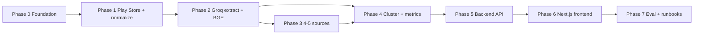

# Implementation Plan

**Project:** AI-Powered Discovery Engine for Myntra Wishlist Behavior  
**Companion docs:** [Architecture.md](./Architecture.md), [problemStatement.md](./problemStatement.md)  
**Scope:** Research prototype — working pipeline, populated DB, Copilot, dashboard, ranked opportunity areas. Not production scraper scale, not product solution design.

---

## How to use this plan

- Phases are **sequential**. Do not start a phase until the previous phase’s **exit criteria** are met.
- Each phase lists **in scope**, **out of scope**, **tasks**, **exit criteria**, and **risks**.
- The spine of the plan is Architecture §22: freeze **metrics + API contracts** before UI; then ship a **single quality frontend** (not a Streamlit prototype to rewrite later).
- **Backend and frontend are separate phases.** Phase 5 must be callable (OpenAPI + contract tests) before Phase 6 starts. The UI never computes SoV, impact, or confidence.
- Unimplemented sources are marked **unavailable** in metrics. Never interpolate counts.

### Suggested duration (one engineer, Groq usage + local BGE)

| Phase | Layer | Focus | Indicative effort |
| --- | --- | --- | --- |
| 0 | Backend | Repo, Postgres, Groq + BGE config | 1–2 days |
| 1 | Backend | Play Store ingest + normalize/PII | 3–5 days |
| 2 | Backend | Groq extract + BGE embed | 4–6 days |
| 3 | Backend | 4–5 source types | 4–6 days |
| 4 | Backend | Cluster + metrics + impact score | 4–6 days |
| 5 | **Backend** | Query API + Copilot API + n-grams + weekly report job | 6–8 days |
| 6 | **Frontend** | Next.js product UI — all Surface B views + Copilot chat | 7–10 days |
| 7 | Both | Q1–Q9 eval + runbooks | 2–4 days |

Durations assume `GROQ_API_KEY`, YouTube, and Reddit credentials are available when that phase starts, and that BGE-M3 weights can download from Hugging Face (or are cached locally).

### Definition of done (whole project)

Matches problem-statement deliverables (Architecture §20):

1. Ingestion covering **at least 4–5** Myntra-relevant source types  
2. Populated **raw + structured** Postgres  
3. **Copilot** answers Q1–Q9 with citations, counts, and confidence  
4. **Dashboard** with all Surface B views  
5. Ranked **opportunity areas** with SoV, impact score, and drill-down quotes  

---

## Phase 0 — Foundation

**Goal:** A runnable repo and empty database that later phases plug into without rewriting contracts.

### In scope

- Repository layout from Architecture §19 (`src/ingest`, `normalize`, `extract`, `embed`, `cluster`, `metrics`, `api`, `prompts/`; `web/` Next.js stub is enough until Phase 6)
- Python project (venv / uv / poetry), `.env.example`, secrets not in git
- PostgreSQL + **pgvector** extension; `vector(1024)` reserved for BGE-M3
- Initial migrations: `raw_documents`, `normalized_documents`, `ingest_runs`, `ingest_queries`
- Shared **raw envelope** types (Architecture §6.1)
- Object store path (local `./data/raw/` is enough)
- Config locked to Architecture §5.1:
  - `GROQ_API_KEY`, `GROQ_BASE_URL=https://api.groq.com/openai/v1`
  - `GROQ_MODEL` (default `openai/gpt-oss-120b`), `GROQ_MODEL_LIGHT` (default `openai/gpt-oss-20b`)
  - `BGE_MODEL_ID=BAAI/bge-m3`, `EMBEDDING_DIM=1024`
  - HMAC secret for `author_hash`, `C_max` / `S_max` placeholders
- No OpenAI (or other) API keys for chat or embeddings

### Out of scope

- Connectors, Groq batch jobs, UI

### Tasks

1. Create package structure and README (run Postgres, migrate, env vars, first-time BGE download).  
2. Write SQL migrations for ingest tables and uniqueness on `(source_type, source_id)`.  
3. Implement `ingest_queries` seed rows (wishlist, cart, sizing, returns, Myntra vs AJIO as comparison talk only).  
4. Add a no-op CLI: `python -m src.cli migrate`.  
5. Smoke: Groq `models.list` (or a 1-token chat) and load BGE-M3, encode one sentence, assert dim == 1024.

### Exit criteria

- [ ] Fresh machine: clone, env, migrate, empty tables queryable  
- [ ] Raw envelope schema frozen and documented in code  
- [ ] Groq reachable with `GROQ_API_KEY`; BGE-M3 loads and returns 1024-d vectors  
- [ ] `.env.example` has Groq + BGE vars only — no OpenAI embedding/chat keys

### Risks

- Changing the envelope after Phase 1 causes connector rewrites — freeze fields early.  
- Hugging Face download blocked — vendor `BAAI/bge-m3` under `./data/models` and point `BGE_MODEL_ID` at the local path.

---

## Phase 1 — First source + normalize / PII

**Goal:** Play Store → raw → normalized, privacy-safe, relevant Myntra reviews only. This is the first closed loop of the pipeline (Architecture §22.1).

### In scope

- Google Play connector (`source_type = play_store`) for the **Myntra** app  
- Incremental watermark: `max(published_at)`  
- Idempotent upsert  
- Full JSON snapshot to object store + `payload_uri`  
- Relevance gate: Myntra shopping / wishlist / cart / sizing / returns / fashion purchase; `reject` not normalized  
- Language detection (`en`, `hi`, `hinglish`, `other`); keep `text_original`; optional `text_en` later  
- Exact-hash dedup; drop empty / emoji-only / boilerplate  
- PII scrub (emails, phones, order IDs, addresses); username → `author_hash` only  
- Keyword-level `product_category` where obvious; else `unknown`  
- `ingest_runs` success/fail logging  

### Out of scope

- Groq extraction, BGE embeddings, other sources, dashboard  
- Near-dup MinHash (can be a Phase 1 stretch or Phase 2)  
- Instagram / Facebook  

### Tasks

1. Implement Play Store worker using `google-play-scraper` (rate limit + backoff).  
2. Write raw rows; never store plaintext username on `normalized_documents`.  
3. Normalize pipeline: relevance → language → dedup → PII → light metadata.  
4. CLI: `ingest play_store` and `normalize --since-run <id>`.  
5. Manual spot-check: 20 rows — no PII, rejects look correct.

### Exit criteria

- [ ] Sample corpus of Play Store reviews in `raw_documents` and `normalized_documents`  
- [ ] Re-running ingest does not duplicate `(play_store, source_id)`  
- [ ] Failed or empty pulls recorded on `ingest_runs`  
- [ ] Operator can disable the source conceptually (flag on `ingest_runs` / config) without inventing metrics  

### Risks

- ToS / blocking — pause connector; do not scrape around blocks (Architecture §6.4).  
- App-store text is often generic (“app crash”) — relevance gate must not empty the corpus; keep app-quality noise in raw, filter in normalize with an auditable `reject` reason.

---

## Phase 2 — Groq extraction + BGE embeddings

**Goal:** Every normalized document can become tags + chunks + BGE vectors, without clustering yet (Architecture §22.2, §5.1).

### In scope

- `chunks` table + `embedding vector(1024)` + `embedding_model = BAAI/bge-m3` (revision stored)
- Chunking: one review ≈ one chunk if short; else 200–500 tokens, 50 overlap
- Local BGE-M3 encode (`sentence-transformers` or FlagEmbedding), L2-normalize, batch on CPU (GPU optional)
- `extractions` table matching Architecture §8.2 JSON schema
- Versioned prompt: `prompts/extract.json`
- **Groq** structured output (`GROQ_MODEL`); JSON schema or `json_object` mode; Pydantic validate; nulls allowed; no guessing
- OpenAI Python SDK only as a **Groq client** (`base_url` = Groq); no OpenAI embeddings
- Cache / skip re-extract when content hash unchanged
- Resume batch from last `document_id`; `extraction_status` (`ok` \| `failed` \| `pending`)
- Failed JSON stays in evidence, **excluded** from later theme metrics
- Copy extraction tags onto chunk metadata for retrieval (even if Copilot is later)
- Optional: cheap translation gloss for low-confidence Hinglish **only as Groq input**, not as replacement of original
- Groq 429/TPM: exponential backoff; cap batch size

### Out of scope

- HDBSCAN, `themes`, dashboard, Copilot UI
- Full segment Groq tagging can start here as a second pass or stay keyword-only until Phase 4
- Any hosted embedding API

### Tasks

1. Freeze Pydantic / JSON schema for extraction (intent_tag, intent_mode, friction_tags, Q mapping, quotes with char spans).
2. Groq batch extract CLI with retries, TPM-aware sleep, and token-usage logging.
3. BGE-M3 embed chunks; store model id + dim 1024; never send text to Groq for vectors.
4. Smoke test: 50 docs — schema validity %, quote spans inside original text, `intent_mode` not conflated with `friction_tag`; nearest-neighbor sizing query returns related chunks.

### Exit criteria

- [ ] Majority of normalized Play Store docs have `extraction_status=ok` via Groq
- [ ] Invalid Groq JSON is retryable and does not crash the batch
- [ ] `SELECT` by `friction_tag` / `intent_mode` / `maps_to_questions` works
- [ ] pgvector cosine on BGE vectors returns related chunks for a sizing query
- [ ] No OpenAI (or other) embedding/chat calls in this path

### Risks

- Groq rate limits — smaller batches, backoff; do not fall back to another LLM provider.
- Groq JSON validity — schema + retries; failed rows stay auditable.
- Hinglish extraction quality — keep original text in the Groq prompt; do not translate-then-discard.
- First BGE download / RAM — cache weights; if needed temporarily use `bge-small-en-v1.5` only with an explicit dim migration plan (full re-embed).

---

## Phase 3 — Multi-source ingest (4–5 types)

**Goal:** Meet the ingest deliverable. Same envelope, same normalize/extract path (Architecture §22.3, §5 source list).

### In scope (must reach 4–5)

| # | Source | Connector notes |
| --- | --- | --- |
| 1 | Google Play | Already done |
| 2 | Apple App Store | Myntra app reviews; same incremental pattern |
| 3 | Reddit | PRAW; subreddits + site search; Myntra-filtered; public only |
| 4 | YouTube | Data API comments on haul / size-guide / vs / unboxing videos mentioning Myntra |
| 5 | **One of:** Quora, X public search, or Myntra public Q&A/reviews | Pick the most ToS-friendly |

- `ingest_queries` drives Reddit/YouTube/X seeds  
- Relevance gate: competitors only **inside** Myntra-relevant docs — **no** competitor app-page crawls  
- Per-source `unavailable` if a connector is skipped or failing  
- n8n **or** cron wrapping the same Python CLIs (n8n can wait until Phase 7 if cron is enough)  
- Rate limits, watermarks, `ingest_runs` per source  

### Out of scope

- Instagram / Facebook groups (remain unavailable)  
- Production-grade scraper HA  

### Tasks

1. App Store connector.  
2. Reddit connector + query table.  
3. YouTube: search videos → pull comments; store video title in `parent_context`.  
4. Fifth source MVP.  
5. Re-run normalize + Groq extract + BGE embed on new docs only.  
6. Document which sources are live vs unavailable in a `source_status` view.

### Exit criteria

- [ ] **≥ 4 source_types** with non-zero `normalized_documents`  
- [ ] Unique constraint holds across all sources  
- [ ] `source_status` lists live vs unavailable (no imputed volumes)  
- [ ] Sample includes wishlist/sizing/returns-like language (qualitative check)

### Risks

- API keys (Reddit, YouTube) block the phase — start key requests at Phase 0.  
- YouTube quota — smaller seed list first.  
- Fifth source legally unclear — prefer App Store + Play + Reddit + YouTube and add Quora only if public HTML is clearly allowed; otherwise document as unavailable.

---

## Phase 4 — Clustering, quantification, impact score

**Goal:** Named **opportunity areas** with shared SQL metrics (Architecture §22.4, §8.3–8.6). This is the analytical core.

### In scope

- `cluster_runs`, `themes`, `document_themes`, `theme_metrics`  
- HDBSCAN on **BGE** embeddings; k-means fallback if corpus is tiny  
- Exclude `not_applicable` / empty friction+intent from clustering  
- Noise ≠ opportunity area; noise remains in evidence  
- **Groq** theme labels (`GROQ_MODEL_LIGHT`): `name`, `description`, `hypothesis_flag`, `bookmark_vs_stall` (`prompts/theme_label.md`)  
- Incremental assign (kNN) vs weekly / N-doc **recluster**; centroid match to preserve `theme_id`  
- Metrics job (SQL or Python writing snapshots): mention_count, share_of_voice, source_diversity, independent_source_density, sentiment_skew, trend_direction (≥2 buckets), segment_concentration, data_confidence, `unavailable_sources`  
- Denominator documented: eligible corpus after relevance + quality  
- Impact score = SoV × sentiment_severity × segment_breadth × data_confidence  
- Do **not** filter monetary-incentive themes  
- Unknown segments stay `unknown`  

### Out of scope

- Dashboard / Copilot UI (Phase 6)  
- n-grams job and remaining metric endpoints (Phase 5)  
- Copilot API (Phase 5)  

### Tasks

1. Cluster CLI + freeze HDBSCAN params in config.  
2. Groq-label clusters; persist `cluster_run_id` on themes.  
3. Implement `theme_metrics` snapshots for global + primary slices (category, source_type, time bucket).  
4. SQL views the Phase 5 API will reuse (single formula; no metric math in the UI).  
5. Sanity: top themes have quotes; impact ranking is explainable from the four factors.

### Exit criteria

- [ ] Ranked theme list with SoV, confidence, impact_score  
- [ ] Every theme joins to ≥1 document and verbatim quote  
- [ ] Missing source appears in `unavailable_sources`, not in SoV numerator/denominator as a fake series  
- [ ] Bookmark vs stall is a theme field and/or `intent_mode` cut, not mixed into one blob  
- [ ] Hypothesis flag set on correlation-looking clusters  

### Risks

- Tiny corpus → few clusters / all noise — Copilot/dashboard must caveat; do not force 10 themes.  
- Recluster renaming — centroid match required before dashboard users exist.

---

## Phase 5 — Serving backend (Query API + Copilot + jobs)

**Goal:** A complete, documented **HTTP contract** that the Phase 6 frontend (and Copilot tools) can trust. Evidence loop in data: **theme stat → quotes → source URL**. No UI in this phase (Architecture §10, §11, §12–13 as *API + jobs*).

### In scope

- FastAPI **Query API** as the only metrics path (OpenAPI published)  
- Global filter query params on every metrics/evidence route: date range, `source_type`, `product_category` (and segment filters where the slice exists)  
- Endpoints:  
  - `GET /metrics/overview`  
  - `GET /metrics/themes`  
  - `GET /metrics/segments`  
  - `GET /metrics/trends`  
  - `GET /metrics/ngrams`  
  - `GET /evidence` (filterable quotes, `theme_id`, tags, CSV export of **scrubbed** text)  
  - `GET /reports` (list artifacts) + `GET /reports/{id}` (download PDF)  
  - `POST /copilot/query`  
- Copilot backend (Architecture §11):  
  - Router: quantitative/comparative → metrics tools first; “why” → BGE vector search + tag filters; thin corpus → decline  
  - Tools wrap Query API methods — **do not** let Groq invent SoV  
  - Same BGE-M3 checkpoint as chunks; Groq tool-calling (`GROQ_MODEL`); BGE never generates text  
  - Context pack, system prompt, confidence bands, citation objects (§11.4)  
  - `chat_sessions` / `chat_messages` without operator PII  
  - Latency target: typically &lt; 15s  
- Jobs: n-gram precompute (1–3 grams, en/hi stopwords); weekly report generator (diff JSON + Groq narrative + charts → PDF on disk)  
- Prototype auth: shared secret (or localhost bind documented)  
- CORS for the local Next.js origin  

### Out of scope

- Any browser UI, Streamlit, Metabase-as-product, Copilot chat chrome  
- Fine-tuning  
- Full Q1–Q9 gold harness (Phase 7) — keep a handful of API probes  
- Email delivery if PDF-on-disk is enough  

### Tasks

1. Implement all Query API routes against `theme_metrics` + evidence joins (no duplicate metric math).  
2. Freeze response schemas (overview, theme card, evidence row, citation, Copilot turn, unavailable_sources).  
3. Copilot tool loop + BGE query embed + retrieval; `prompts/copilot_system.md`.  
4. N-gram job + report job; `GET /reports`.  
5. Contract tests: SoV / impact / mention_count match SQL for the same filters; Copilot numbers ⊆ tool JSON.  
6. Manual API probes: footwear vs ethnic (metrics first); “why wishlist” (tags + quotes); low-n slice declines; refuse product solutions.

### Exit criteria

- [ ] OpenAPI covers every route Phase 6 will call; example responses checked in  
- [ ] Theme list + SoV + `data_confidence` + mention_count + `unavailable_sources` match `SELECT` on `theme_metrics`  
- [ ] Every published theme has ≥1 evidence row with a URL or explicit `link_unavailable`  
- [ ] `POST /copilot/query` returns citations + counts for at least one quantitative and one qualitative question; thin-evidence caveats or declines; refuses solutioning  
- [ ] N-grams and trends are served from precomputed tables  
- [ ] One weekly PDF exists from a real `theme_metrics` diff (header lists corpus, included sources, unavailable sources, correlation caveat)  
- [ ] Failed ingest is represented as **source unavailable** in API JSON, not a silent prior-week volume  

### Risks

- Shipping UI-shaped JSON that still requires the client to re-aggregate — forbid; each chart series is an API field.  
- Groq ignoring tools — require numbers only from tool JSON; fail the turn on mismatch.  
- Groq 429 mid-chat — retry once, then structured error (do not switch hosts).  
- Prompt injection from comments — treat chunks as untrusted data.  
- Report Groq adding recommendations — same refuse-solutions rule as Copilot.

---

## Phase 6 — Product frontend (Next.js)

**Goal:** A **single, high-quality research product** for PM / Insights: all Architecture §12 views plus Copilot chat, with the evidence loop **theme stat → quotes → source URL** as the primary interaction. Looks and behaves like an internal product, not a notebook or Streamlit prototype.

### Locked stack

| Choice | Decision |
| --- | --- |
| App | **Next.js (App Router) + TypeScript** in `web/` |
| Styling | Tailwind + a real component kit (e.g. shadcn/ui) — shared tokens, not ad-hoc CSS per page |
| Data | TanStack Query (or equivalent) against Phase 5 OpenAPI only |
| Charts | One chart library (e.g. Recharts); series come from the API, never `reduce` on evidence rows |
| Filters | Global filter bar; **URL query string is source of truth** so views stay in sync and are shareable |
| Not allowed | Streamlit, Metabase-as-the-app, client-side SoV / impact / confidence math |

### Quality bar (Must)

This phase is not “charts exist.” It is **usable by a PM without a walkthrough**.

- **App shell:** persistent sidebar (Overview, Themes, Evidence, Categories, Trends, Segments, Sources, Phrases, Reports, Copilot), header with global filters, last ingest / cluster refresh timestamp.  
- **Visual system:** type scale, spacing, and color tokens for sentiment, confidence bands, `unavailable`, `hypothesis`, bookmark vs stall. Sufficient contrast; focus states on interactive controls.  
- **Theme explorer is the hero:** ranked opportunity cards (rank, name, SoV, mention count, sentiment, impact, confidence). Sort by impact. Click → evidence drawer (not a dead-end modal).  
- **Evidence drawer / table:** quote, tags, source, date, outbound URL (or “link unavailable”). Search and filter. CSV export is scrubbed text only.  
- **Empty / error / unavailable:** distinct states. Failed Play ingest → badge + copy, not last week’s volume unless labeled “last successful pull: date”. Zero-result filters → empty, not a stale cache.  
- **Copilot:** full-page chat in the same app. Streaming or clear “still retrieving” if &gt; a few seconds. Citation **chips** open the **same** evidence drawer (`document_id` / `chunk_id`). Confidence and unavailable sources visible on the turn.  
- **Layout:** desktop-first (analyst workstation, ~1280px+); usable down to ~768px. No broken overflow on tables.  
- **Motion / polish:** skeletons on first load; no layout jump when filters apply; numbers formatted consistently from API (same decimals as the contract).  
- **Honesty in the chrome:** denominator label on SoV; `unknown` segment always visible; bookmark vs stall not merged into one chip.

### In scope (Architecture §12 + Copilot)

- Corpus overview (counts by source, date histogram, last ingest, unavailable badges)  
- Category breakdown  
- Theme / opportunity explorer + drill-down  
- Word / phrase frequency (table + cloud; **theme or category filter required** for the cloud)  
- Sentiment trend  
- Segment comparison heatmap (include **unknown**)  
- Source / platform breakdown  
- Raw evidence table  
- Automated reporting list + PDF download  
- Insight Copilot chat  

### Out of scope

- Consumer-grade marketing site, Myntra shopper UI, SSO beyond shared secret  
- Re-implementing metric formulas in the client  
- Email of reports (download is enough)  
- Fine-tuning; full Q1–Q9 gold harness (Phase 7)  

### Tasks

1. Scaffold `web/` (App Router, env for API base URL + shared secret, auth gate).  
2. Design tokens + app shell + global filter bar wired to URL.  
3. Theme explorer + evidence drawer (core loop) first; then remaining §12 routes.  
4. Copilot page: compose `POST /copilot/query`, render answer + citation chips + confidence.  
5. Chart pages consume API series only; small-n cells caveated in the UI.  
6. QA in the browser: three themes, SoV matches API; Copilot count matches theme card for the same filters; unavailable Play Store visible on overview **and** Copilot.

### Exit criteria

- [ ] PM can open the app, see corpus + ranked themes, drill to quotes and the source URL  
- [ ] Every Architecture §12 view exists and uses the global filters  
- [ ] Dashboard numbers match the Query API (and therefore SQL) for the same filters  
- [ ] No theme without a drill-down path  
- [ ] Copilot citations open the evidence drawer; Copilot counts match the API for the same slice  
- [ ] Quality bar above is met (shell, tokens, empty/unavailable, URL filters, no Streamlit)  

### Risks

- Building charts that re-aggregate in the client — **forbid**; API only (EC-Q-13).  
- Treating this as a weekend Streamlit spike — reject that shortcut; it forces a rewrite before Copilot.  
- Word clouds without a theme/category filter — table-only until a filter is set.  
- Filter state local to one page — overview and evidence would disagree; URL is mandatory.

---

## Phase 7 — Evaluation, runbooks, hardening

**Goal:** Repeatable quality bar and operator playbook (Architecture §22.7, §11.5, §18).

### In scope

- Hold-out / gold set: paraphrases of **Q1–Q9**  
- Scores: citation present, metric matches SQL, decline when confidence low, bookmark vs stall not merged, no solutioning  
- Run after each cluster refresh  
- Operator runbook: source quota/block, Groq 429 / invalid JSON, empty cluster, BGE checkpoint bump, theme recluster  
- Prompt versions, `GROQ_MODEL` / `GROQ_MODEL_LIGHT`, BGE id/revision, and `cluster_run_id` recorded  
- n8n (if not done) for scheduled ingest → normalize → Groq extract → BGE embed → weekly cluster threshold  
- README: how to run full pipeline, which sources are live, Groq cost / TPM caveats, BGE local cache  
- Optional: shared-secret auth if exposing beyond localhost  

### Out of scope

- Production HA, multi-region, SSO unless required  
- Expanding to Instagram/Facebook  

### Tasks

1. `evals/q1_q9.jsonl` + scorer script.  
2. `docs/Runbook.md` from Architecture §18.  
3. Wire schedules; confirm `unavailable` on a simulated source outage.  
4. Freeze constants (`C_max`, `S_max`, Groq model ids, `BGE_MODEL_ID`) in config; note they must not change silently.

### Exit criteria

- [ ] Eval run documented (even if some Qs caveat due to thin data)  
- [ ] Operator can pause a source and see unavailable on dashboard + Copilot  
- [ ] Recluster preserves theme ids or UI shows “themes refreshed on …”  
- [ ] Project-level definition of done (top of this doc) is checked  

### Risks

- Treating eval failures as “need more scraping” when the real issue is Groq extraction schema — fix prompts first.  
- Switching Groq models mid-eval without recording the id — freeze `GROQ_MODEL` for a scored run.

---

## Cross-cutting rules (every phase)

| Rule | Action |
| --- | --- |
| PII | Hash/drop before normalize and before BGE embeddings |
| Public data only | No authenticated / private groups |
| Model hosts | **Groq only** for generation; **BGE only** (local) for vectors — no OpenAI chat/embed |
| One metrics truth | UI and Copilot use Query API / SQL views only |
| Frontend quality | One Next.js app; no Streamlit; no client-side SoV/impact math |
| Honest gaps | Unavailable ≠ zero; do not interpolate |
| Discovery not solutions | No feature recommendations in Copilot or reports |
| Bookmark vs stall | `intent_mode` first-class from Phase 2 onward |
| ToS | Disable connector rather than bypass blocks |

---

## Dependency graph

Phases 0–5 are **backend**. Phase 6 is the only **frontend** phase. Phase 7 evaluates both.

Phase 3 and Phase 4 both need Phase 2. Prefer **Phase 3 before a “final” cluster** so themes reflect multiple sources; a **dev cluster on Play Store only** after Phase 2 is allowed for pipeline debugging, then recluster after Phase 3.

Phase 6 must not start until Phase 5 OpenAPI + contract tests pass. A CLI against `POST /copilot/query` is a Phase 5 debug aid, not a substitute for the Next.js Copilot page.

---

## What not to pull forward

Do not jump to Copilot or the Next.js app before Phase 4 metrics **and** Phase 5 API contracts exist — the UI would show unquantified summaries or invent SoV, which the problem statement forbids.

Do not add Instagram/Facebook, recs models, or Myntra internal funnel data. Label themes that need funnel triangulation as **hypothesis**.
